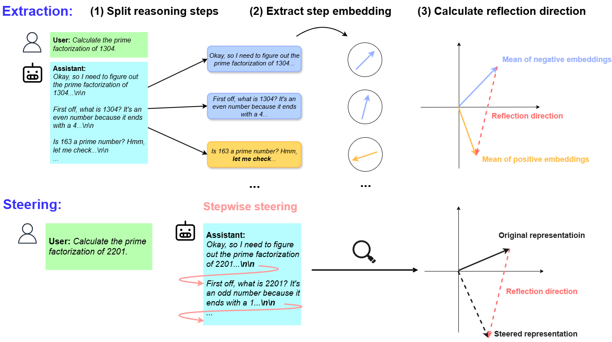

# ReflCtrl: Controlling LLM Reflection via Representation Engineering
This is the official repository for [ReflCtrl: Controlling LLM Reflection via Representation Engineering](https://openreview.net/forum?id=ungnJ4O0AD).
For more information, please check out the [project website](https://lilywenglab.github.io/ReflCtrl/).
## Overview
In this work, we study the self-reflection behavior of Large Reasoning Models (LRMs) from the perspective of representation engineering. We segment model’s reasoning into steps, identify the steps corresponding
to reflection, and extract a reflection direction in the latent space that governs this
behavior. Using this direction, we propose a stepwise steering method that can
control reflection frequency. 

## Preparation
To start, install all dependency by 
```
pip install -r requirements.txt
```
## Extract reflection direction
Before steering, extract reflection direction by running
```
bash run_collect_and_extract.sh
```
## Steering
For running steering experiments, we first host our model via vllm. For example:
```
python launch_server.py --gpus 2 --model deepseek-r1-qwen-1.5b  --router_port 8088 --step_begin_only --intervention_layers 6-22 --max_model_len 16384
```
When server is ready, run `query_llm.py` for evaluation:
```
python query_llm.py --dataset gsm8k --max_length 8192 --instruction " Please reason step by step, and put your final answer within \boxed{}."  --mode api --model deepseek-r1-qwen-1.5b --n_samples 4  --step_begin_only --with_intervention -0.48 --intervention_layers 6-22

```
## Cite this work
ReflCtrl: Controlling LLM Reflection via Representation Engineering, Ge Yan, Chung-En Sun, Tsui-Wei Weng, NeurIPS MI workshop 2025.
```
@misc{
yan2025reflctrl,
title={ReflCtrl: Controlling {LLM} Reflection via Representation Engineering},
author={Ge Yan and Chung-En Sun and Tsui-Wei Weng},
booktitle={Mechanistic Interpretability Workshop at NeurIPS 2025},
year={2025},
url={https://openreview.net/forum?id=ungnJ4O0AD}
}
```
